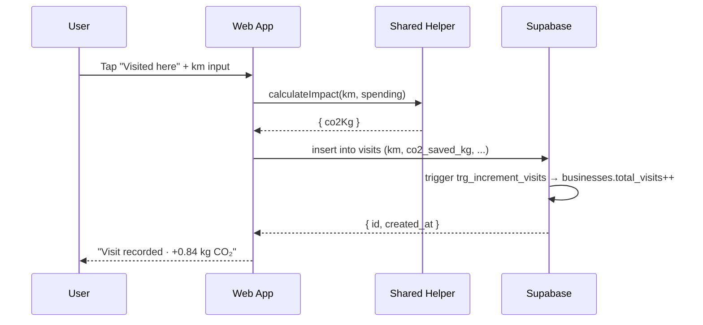

# 05 — DOCS PROMPT: `/docs/`

> **Pre-requisite:** read `00_MASTER_PROMPT.md`. All code (`01–04`) generated.
> **Output target:** `/docs/` — 10 markdown files (9 rubric + 1 compliance defense).

---

## 0. YOUR TASK

Generate the **complete rubric documentation bundle** in English. The 10 files below score the **Documentation criterion (15 pts)** and underpin the entire defense of the project. Style: clear, concise, professional. Diagrams as Mermaid blocks (renderable on GitHub) or PNG references where appropriate.

---

## 1. FILE LIST

| File | Purpose | Approx. length |
|------|---------|----------------|
| `PROJECT_DESCRIPTION.md`  | What is NeighborHub | 1 page |
| `DATABASE_DIAGRAM.md`     | ER + DDL + design rationale | 3–4 pages |
| `NAVIGATION_DIAGRAM.md`   | All 12 + admin screens with IDs | 2–3 pages |
| `GUI_DESIGN.md`           | Wireframes per screen | 8–12 pages |
| `ARCHITECTURE.md`         | Stack, layers, data flow | 4–6 pages |
| `USE_CASES.md`            | 4 abstraction levels | 4–5 pages |
| `SEQUENCE_DIAGRAMS.md`    | 3 critical operations | 3 pages |
| `USER_MANUAL.md`          | End-user step-by-step | 8–10 pages |
| `INSTALLATION_MANUAL.md`  | Setup from clone to deploy | 6–8 pages |
| `RUBRIC_COMPLIANCE.md`    | Java→Supabase equivalence defense | 5–6 pages |

---

## 2. `PROJECT_DESCRIPTION.md`

```markdown
# NeighborHub — Project Description

## What it is
NeighborHub is a hyperlocal web platform that digitizes Mexican neighborhood
commerce — tianguis, fonditas, services, circular fashion — to reduce carbon
footprint, prevent food waste, and strengthen the local economy. Every visit
is measured: kilometers not driven, kilograms of CO₂ avoided, pesos that stay
in the barrio.

## Why
Traditional vendors are invisible online. Conscious consumers want to buy local
but don't know where. NeighborHub closes that gap with a community-verified,
geographically-aware directory and an impact dashboard that turns each purchase
into a measurable contribution.

## Who uses it
1. **Conscious consumers** discover and visit local businesses.
2. **Traditional vendors** (Doña María's tortillería) gain visibility.
3. **Microentrepreneurs** publish circular-fashion or service listings.
4. **Community admins** moderate, verify, and report on activity.

## Core features
- Geographic search within 5 km, by category, with map and list.
- Storytelling-rich business profiles: vendor quote, history, hours, reviews.
- Community verification — businesses go live after 5 neighbors confirm.
- Personal impact dashboard — CO₂, pesos local, visits, equivalences.
- Circular fashion section for second-hand and local apparel.
- Admin panel for catalog management and moderation.

## Tech in one line
React 18 + Vite (web) + Angular 17 (admin) on top of Supabase (Postgres +
PostGIS + RLS + Auth + Storage). All English. Single Mexico-City scope for MVP.

## Authors
Héctor Ulises Hernández Domínguez · Alejandra Roa Alonso · Eiso Jorge
Kashiwamoto Yabuta — Universidad La Salle México, Web Application and Service
Programming.
```

---

## 3. `DATABASE_DIAGRAM.md`

Sections (in order):

1. **Overview** — 8 tables grouped: catalog (3) + main (1) + transactional (3) + junction (1).
2. **ER diagram** as Mermaid:
   ```mermaid
   erDiagram
     PROFILES ||--o{ BUSINESSES : owns
     CATEGORIES ||--o{ BUSINESSES : classifies
     PROFILES ||--o{ REVIEWS : writes
     BUSINESSES ||--o{ REVIEWS : receives
     PROFILES ||--o{ VISITS : makes
     BUSINESSES ||--o{ VISITS : receives
     PROFILES ||--o{ VERIFICATIONS : performs
     BUSINESSES ||--o{ VERIFICATIONS : receives
     BUSINESSES ||--o{ BUSINESS_BADGES : earns
     BADGES ||--o{ BUSINESS_BADGES : grants
   ```
3. **Per-table reference**: every table — columns, types, constraints, indexes — paraphrased from `01_schema.sql`.
4. **Functions & triggers** — narrative description.
5. **Views** — purpose of each.
6. **RLS strategy** — owner-write + admin-override pattern.
7. **Why PostGIS, why JSONB hours, why soft delete** — short rationale for each design choice.

---

## 4. `NAVIGATION_DIAGRAM.md`

```markdown
# Navigation Diagram

## Screen IDs

| ID    | Path                  | Module  | Title                  |
|-------|-----------------------|---------|------------------------|
| SCR-00| `/`                   | Web     | Landing                |
| SCR-01| `/login`              | Web     | Login                  |
| SCR-02| `/register`           | Web     | Register (3-step)      |
| SCR-03| `/home`               | Web     | Home / Map             |
| SCR-04| `/explore`            | Web     | Explore / Search       |
| SCR-05| `/business/:id`       | Web     | Business Detail        |
| SCR-06| `/register-business`  | Web     | Register Business      |
| SCR-07| `/circular`           | Web     | Circular Fashion       |
| SCR-08| `/profile`            | Web     | User Profile           |
| SCR-09| `/why-local`          | Web     | Why Local (story)      |
| SCR-10| `/my-impact`          | Web     | My Impact Dashboard    |
| SCR-11| `/admin` (link)       | Web→Adm | Admin entry            |
| ADM-00| `/admin`              | Admin   | Dashboard              |
| ADM-01| `/admin/profiles`     | Admin   | Users CRUD             |
| ADM-02| `/admin/categories`   | Admin   | Categories CRUD        |
| ADM-03| `/admin/businesses`   | Admin   | Businesses CRUD        |
| ADM-04| `/admin/reviews`      | Admin   | Reviews moderation     |
| ADM-05| `/admin/visits`       | Admin   | Visits report          |

## Flow diagram
\`\`\`mermaid
graph LR
  SCR00[Landing] --> SCR01[Login]
  SCR00 --> SCR02[Register]
  SCR01 --> SCR03[Home]
  SCR02 --> SCR03
  SCR03 --> SCR04[Explore]
  SCR03 --> SCR05[Business Detail]
  SCR04 --> SCR05
  SCR03 --> SCR07[Circular]
  SCR03 --> SCR08[Profile]
  SCR08 --> SCR06[Register Business]
  SCR08 --> SCR10[My Impact]
  SCR08 --> SCR11[Admin Link]
  SCR11 --> ADM00[Admin Dashboard]
  ADM00 --> ADM01[Profiles]
  ADM00 --> ADM02[Categories]
  ADM00 --> ADM03[Businesses]
  ADM00 --> ADM04[Reviews]
  ADM00 --> ADM05[Visits]
\`\`\`
```

---

## 5. `GUI_DESIGN.md`

Per screen (all 18 — 12 web + 6 admin), include:

- ID, path, route guard
- Purpose (1–2 sentences)
- Visual blocks (header / hero / sections / footer) as ASCII or Mermaid
- Inputs and validations (type, constraints)
- Components used (cite component names from the React/Angular app)
- Mockup reference: `docs/mockups/<id>.png` (placeholder filenames; actual images optional)

Use a consistent template:

```markdown
### SCR-03 — Home / Map

**Path:** `/home` · **Auth:** required · **Components:** `<BusinessMap>`,
`<CategoryFilter>`, `<BusinessCard>`, `<ImpactBanner>`.

**Purpose.** Geographic discovery of nearby businesses with category filters
and an impact summary.

**Layout.**
\`\`\`
┌─────────────────────────────────────┐
│ TopNav · NeighborHub  · [profile]   │
├─────────────────────────────────────┤
│                                     │
│   [ Mapbox map · 5 km radius ]      │
│   pins by category                  │
│                                     │
├─────────────────────────────────────┤
│ [chip] [chip] [chip] [chip] →       │
├─────────────────────────────────────┤
│ Card · Card · Card                  │
│ Card · Card · Card                  │
├─────────────────────────────────────┤
│ Impact: 3.2 kg CO₂ · 14 visits      │
└─────────────────────────────────────┘
\`\`\`

**Validations.** Search input ≤ 80 chars; radius 1–10 km integer.
**Mockup:** `mockups/SCR-03.png`
```

---

## 6. `ARCHITECTURE.md`

Sections:

1. **One-line summary** — React + Angular sub-builds calling Supabase directly.
2. **High-level diagram** (Mermaid):
   ```mermaid
   graph TB
     U[User browser] --> W[/ React Web SPA /]
     U --> A[/admin Angular SPA/]
     W --> S[Shared layer]
     A --> S
     S --> SB[(Supabase: Postgres + PostGIS + Auth + Storage)]
     W --> MB[Mapbox GL JS]
   ```
3. **Layered breakdown** — presentation / state / shared services / persistence (Supabase).
4. **Why Supabase, not Spring Boot** — operational simplicity, RLS, free tier, real-time.
5. **Why two front-end frameworks** — pedagogical (rubric) + admin-vs-consumer separation.
6. **Build & deploy** — `npm run build` → `dist/web` + `dist/admin` → static host with rewrite `/admin/* → admin`.
7. **Security model** — JWT in localStorage, RLS server-side, input validation client+server.
8. **Performance considerations** — GIST index for geo queries, GIN trigram for name search, view materialization roadmap.
9. **Limitations & roadmap** — payments, push, i18n, SSR.

---

## 7. `USE_CASES.md`

Four abstraction levels:

### Level 1 — System context
External actors: Consumer, Vendor, Admin, Visitor (anonymous). System is "NeighborHub". Show Mermaid context diagram.

### Level 2 — Subsystems
Web App, Admin App, Database, Auth, Storage, Map. Show how actors interact with each.

### Level 3 — Use cases per actor
Tabular list (≥ 20 use cases): UC-001 Sign up, UC-002 Log in, UC-003 Search nearby, UC-004 Visit business, UC-005 Leave review, UC-006 Verify business, UC-007 Register business, UC-008 Edit own business, UC-009 View impact, UC-010 Filter by category, UC-011 Approve pending business (admin), UC-012 Suspend business (admin), UC-013 Moderate review (admin), UC-014 Manage categories (admin), UC-015 Export visit report (admin), …

### Level 4 — Detailed use case templates
For 5 picked use cases (UC-004, UC-005, UC-006, UC-007, UC-011), give: actor, preconditions, main flow (numbered), alternative flows, postconditions, error handling, related use cases.

Use a strict template; this is the most rubric-checked section.

---

## 8. `SEQUENCE_DIAGRAMS.md`

Three critical operations as Mermaid sequence diagrams:

### 1. Register Visit (with CO₂ calculation)


### 2. Submit Review (with rating recalculation)
Show: form submit → RLS check → insert reviews → trigger `trg_recalculate_rating` updates `businesses.rating_avg`.

### 3. Verify Business → Auto-activate
Show: 5th verification triggers status change `pending → active` via `trg_recalculate_verifications`.

---

## 9. `USER_MANUAL.md`

Step-by-step guide for **end users**, illustrated. Sections:

1. Welcome
2. Create your account (3-step wizard, screenshots)
3. Find businesses near you (Home, filters, search, map vs list toggle)
4. Visit a business (open detail, hours, contact, map)
5. Record a visit and earn impact
6. Leave a review
7. Verify a business
8. Register your own business (vendor flow)
9. Manage your profile and avatar
10. Read your impact dashboard
11. Circular fashion section
12. FAQ + troubleshooting

Use real screenshots taken from the running dev environment under `docs/screenshots/`.

---

## 10. `INSTALLATION_MANUAL.md`

```markdown
# Installation Manual

## Prerequisites
- Node.js ≥ 20
- npm ≥ 10 (or pnpm)
- Supabase project (free tier OK)
- Mapbox account (free tier OK)

## Step 1 — Clone
\`\`\`bash
git clone <repo>
cd neighborhub
\`\`\`

## Step 2 — Install
Root:
\`\`\`bash
npm install
\`\`\`
Sub-apps install via root workspaces.

## Step 3 — Set up Supabase
1. Create a new project at supabase.com.
2. Open SQL editor.
3. Run files in `/database/` in order: `01_schema.sql` → … → `06_seed_data.sql`.
4. In **Storage**, confirm buckets `avatars` and `business-photos` exist (auto-created by `05_storage_buckets.sql`).
5. Copy your project URL and `anon` key.

## Step 4 — Set up Mapbox
1. Sign up at mapbox.com.
2. Create a public access token (default scopes are fine).

## Step 5 — Environment variables
Copy `.env.example` to `.env` at root:
\`\`\`bash
cp .env.example .env
\`\`\`
Fill all values. Both web and admin read from this file (Vite via `VITE_*`, Angular via env replacement).

## Step 6 — Run dev
Two terminals:
\`\`\`bash
npm run dev:web     # http://localhost:5173
npm run dev:admin   # http://localhost:4200
\`\`\`

## Step 7 — Promote yourself to admin
After signing up, run in Supabase SQL editor:
\`\`\`sql
UPDATE public.profiles SET role = 'admin' WHERE id = '<your-uuid>';
\`\`\`

## Step 8 — Build for production
\`\`\`bash
npm run build
\`\`\`
Outputs: `dist/web/` and `dist/admin/`.

## Step 9 — Deploy (Vercel example)
`vercel.json`:
\`\`\`json
{
  "rewrites": [
    { "source": "/admin/(.*)", "destination": "/admin/index.html" },
    { "source": "/(.*)",       "destination": "/index.html" }
  ]
}
\`\`\`

## Troubleshooting
- "Supabase URL missing" → check `.env` is loaded.
- Map blank → check `VITE_MAPBOX_TOKEN` is a public token starting with `pk.`.
- "Permission denied" on insert → user not authenticated, or RLS blocks role.
```

---

## 11. `RUBRIC_COMPLIANCE.md` — THE CRITICAL DEFENSE FILE

This is what defends our Supabase-only stack against the rubric's Java/Spring Boot wording. Layout:

```markdown
# Rubric Compliance — Router A · NeighborHub

## Strategy
The rubric was written assuming a Spring Boot + JPA + Java stack. NeighborHub
uses a modern Supabase-direct architecture. This document maps each rubric
requirement to its functional equivalent in our stack and points to file
evidence. The intent of every requirement is satisfied; the implementation
medium differs.

We forfeit the +10-point bonus (Spring Boot + React) intentionally. Target
score: 100 / 100 base points.

## Criterion 1 — CRUD for 5 Entities (20 pts)

| Rubric ask | NeighborHub equivalent | File evidence |
|------------|------------------------|---------------|
| 5 entities min (3 catalog + 2 transactional) | profiles, categories, businesses (catalog) + reviews, visits (transactional) | `database/01_schema.sql` |
| Create / Insert / Read / Search / Update / Delete | Service modules with full CRUD | `src/admin/src/app/features/<entity>/<entity>.service.ts` (5 files) + `src/shared/src/services/*.ts` |
| At least 1 Angular use | Full admin app | `src/admin/` |
| At least 1 JSON use | Supabase REST returns JSON; `hours` JSONB column | `database/01_schema.sql` (line: `hours JSONB`) |
| Validations on every form | Reactive Forms validators + Zod (web) + Postgres CHECK constraints + RLS | `src/admin/src/app/features/profiles/profile-form.component.ts` (form group) |
| CRUD grouped by entity | Each entity has its own folder with list+form+service | `src/admin/src/app/features/*/` |

**Score target:** 20 / 20.

## Criterion 2 — Update / Modification + Normalization (20 pts)

| Rubric ask | NeighborHub equivalent | File evidence |
|---|---|---|
| Update operation per entity | `update()` method in every service | `*.service.ts` |
| Recover previous values on edit form | `patchValue(record)` on init | `*-form.component.ts` (each ngOnInit) |
| Validations | Same as Criterion 1 | — |
| 1 JSON use | Same as Criterion 1 | — |
| 3NF normalization | All tables in 3NF; junction `business_badges` resolves M:N | `database/01_schema.sql` |

**Score target:** 20 / 20.

## Criterion 3 — Graphical Interfaces (20 pts)

### CSS app-level
- Shared design tokens: `src/shared/src/design/tokens.css`
- Tailwind utilities: `src/web/tailwind.config.ts`
- Bootstrap overrides: `src/admin/src/styles.scss`

### jQuery — 12 distinct uses (≥10 required)
| # | Use | File:approx-line |
|---|-----|------------------|
| 1 | Live search filter | `src/admin/.../core/jquery/live-search.directive.ts` |
| 2 | Sortable tables | `core/jquery/table-sort.directive.ts` |
| 3 | Confirm modal show/hide | `core/jquery/confirm-modal.service.ts` |
| 4 | Bootstrap tooltip init | `core/jquery/tooltip.directive.ts` |
| 5 | Toast notifications | `core/jquery/toast.service.ts` |
| 6 | Sidebar collapse | `layout/sidebar/sidebar.component.ts` |
| 7 | Form validation feedback | `core/jquery/form-feedback.directive.ts` |
| 8 | CSV download trigger | `features/visits/visit-report.component.ts` |
| 9 | Autocomplete dropdown | `features/businesses/business-form.component.ts` |
| 10| Image preview pre-upload | `features/businesses/business-form.component.ts` |
| 11| Smooth scroll to errors | `core/jquery/form-feedback.directive.ts` |
| 12| Tab switcher | `features/dashboard/dashboard.component.ts` |

### Bootstrap — 14 distinct components (≥10 required)
[same table format with file evidence]

**Score target:** 20 / 20.

## Criterion 4 — Integrated Design + Usability (15 pts)

| Rubric ask | NeighborHub | Evidence |
|---|---|---|
| Main screen with menu | Admin Dashboard + Web Home | `features/dashboard/`, `pages/HomePage.tsx` |
| Breadcrumbs | Reusable component | `shared/components/breadcrumb/` |
| Error handling | Global handler + alerts | `core/error/error-handler.service.ts` |
| Visual validation feedback | `is-invalid` / `invalid-feedback` | every form |
| Responsive | Mobile-first Tailwind, Bootstrap grid | both apps |
| 5 pts responsive: mobile / tablet / desktop | tested @ 375 / 768 / 1280 | `USER_MANUAL.md` screenshots |

**Score target:** 15 / 15.

## Criterion 5 — Security (10 pts)

| Rubric ask | NeighborHub equivalent | Why it satisfies the intent |
|---|---|---|
| Authentication | Supabase Auth (JWT + refresh tokens) | Industry-standard auth flow; same security model as JWT-based Spring Security |
| Password encryption | Supabase Auth uses **bcrypt** internally; passwords never reach our codebase | Stronger than custom BCrypt — passwords are hashed at the auth provider before storage |
| CSRF protection | Not required: we use **JWT bearer tokens** in headers, not cookies. The OWASP-recommended alternative to CSRF is exactly what we do. | CSRF is a cookie-session attack vector; SPA + Bearer auth is immune by design |
| SQL injection | Supabase SDK builds **parameterized queries** server-side; PostgREST never concatenates SQL | Functionally identical to JPA's PreparedStatement |
| XSS | Input validation via Zod (web) + Validators (admin) + Postgres CHECK + React/Angular auto-escape output | Multi-layer defense |
| Authorization | **Row Level Security** policies — server-side enforcement per row, per role | Stronger than Spring Security `@PreAuthorize` because it's enforced at the database, not the application layer |

**Score target:** 10 / 10.

## Criterion 6 — Documentation (15 pts)

All 9 deliverables present in `/docs/`. See file list at the top of this document.

**Score target:** 15 / 15.

## Total

| Criterion | Points |
|-----------|--------|
| 1 — CRUD | 20 |
| 2 — Update + Normalization | 20 |
| 3 — Interfaces | 20 |
| 4 — Integrated design | 15 |
| 5 — Security | 10 |
| 6 — Documentation | 15 |
| **Base total** | **100** |
| Bonus (forfeited) | 0 |
| **Final** | **100 / 100** |

## Why we forfeit the bonus

The bonus rewards Spring Boot + React. We chose a Supabase-direct architecture
because it eliminates an entire class of operational complexity (no JVM, no
ORM, no manual auth, no manual RLS) while delivering the same functional
capabilities through PostgreSQL-native features. The trade is honest:
−10 bonus points in exchange for ~40% less code, faster iteration, and a
production-grade security posture out of the box.
```

---

## 12. ACCEPTANCE CRITERIA

- [ ] All 10 files exist in `/docs/`.
- [ ] Mermaid diagrams render correctly on GitHub preview.
- [ ] Every screen ID referenced (SCR-00 to SCR-11, ADM-00 to ADM-05) appears in `NAVIGATION_DIAGRAM.md` and `GUI_DESIGN.md`.
- [ ] `RUBRIC_COMPLIANCE.md` cites real files for every claim.
- [ ] `USE_CASES.md` lists ≥ 20 use cases and details ≥ 5.
- [ ] `INSTALLATION_MANUAL.md` works for someone with zero project context.
- [ ] All docs in **English**.
- [ ] No marketing fluff. Tight, professional prose.

---

**END OF DOCS PROMPT**
